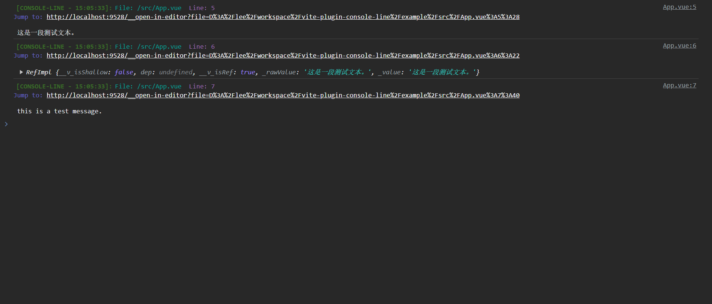
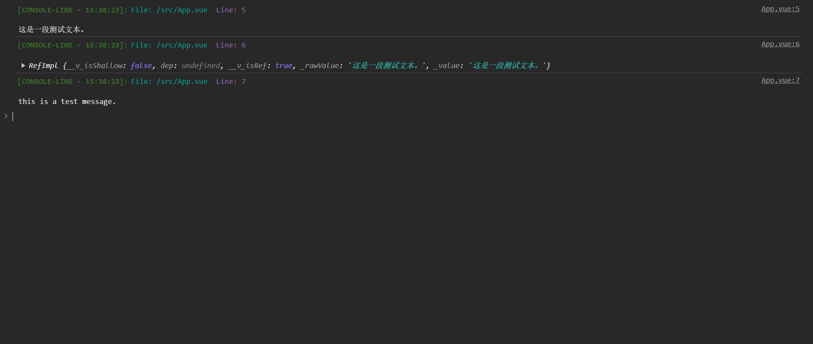

# vite-plugin-console-line

## 📝 Brief
A vite plugin,that show your **console.log(xx)** timestamp, file location and line number.

## 🛠️ Developer Tech Stack
Template provides a minimal setup to get React working in Vite with HMR and some ESLint rules.
Include example project for tests.

## ✨ Features
Using some params:
- **exclude** : the paths that you don`t want to transform.
- **port** : if you want to navigate from the browser's console to the editor, 
you should set this field, and the field value should be the port of your proxy server.

## ⚡ How To Start
1) Install package:
```Bash
npm install vite-plugin-console-log
```
2) Add to plugin array on 'vite.config.js':

```JSX
import { defineConfig } from 'vite'
import consoleLine from "vite-plugin-console-log";

export default defineConfig({
  plugins: [
		consoleLine({ exclude: ["node_modules"] }),
  ]
});
```

## 🎞️ Screenshots



## 💡 Update (or fixes) requests
Fully ready for further use.